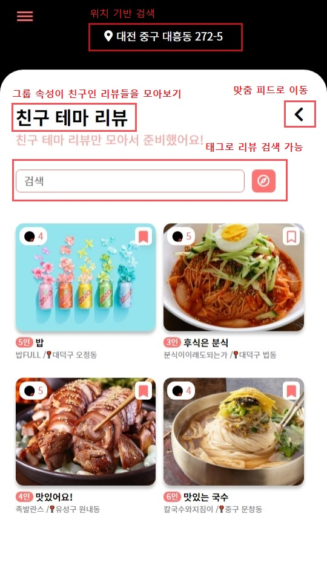
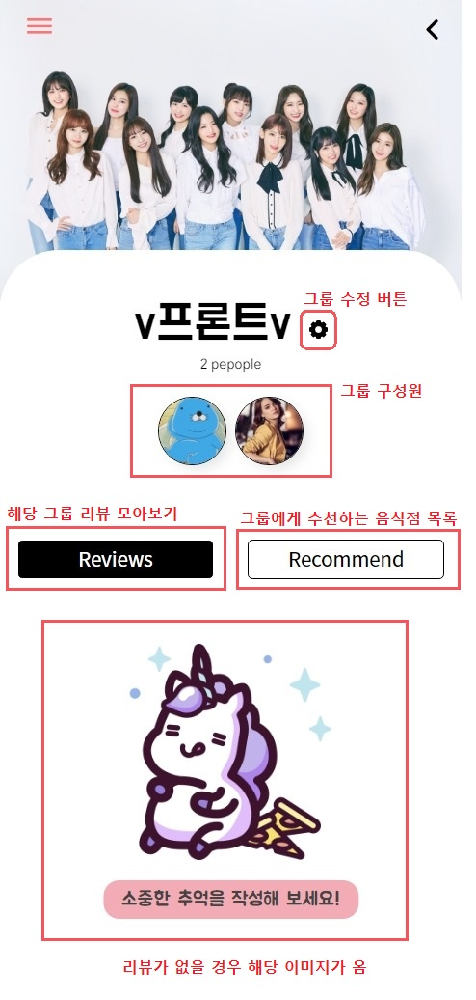

# Welcome to YogoMogo!
## 👀 서비스 소개
요고모고는 사용자가 등록한 그룹 단위로 음식점 추천과 추천 피드를 제공하는 서비스입니다. 친구들과 뭘 먹을지 더 이상 고민하지 마세요! 
## 🏠 [Homepage](https://just-eat-it-203.web.app/)


## ⭐️ 주요 기능
- **개인 맞춤 리뷰 피드 제공**
	사용자의 취향에 가까운 음식점들의 리뷰를 제공해준다. 테마별로 모아 볼 수 있고, 전국적 인기 리뷰들을 볼 수 있을 뿐 아니라, 사용자의 현재 위치 기반으로 동네에서 발생한 리뷰들을 확인할 수 있다.
	
- **테마별 피드 모아보기**
	사용자가 선택한 그룹의 성격에 따라 리뷰를 분류하여 사용자의 현재 위치 기반으로 필터링한 리뷰들을 보여준다. 선택할 수 있는 테마는 다음과 같다.
	- 가족
	- 친구
	- 애인
	- 회식


- **나만의 그룹페이지**
	사용자가 직접 그룹명, 그룹 이미지, 그룹원들을 지정해서 그룹을 만들 수 있다. 그룹페이지에서 그룹원들과 함께 갔던 가게의 리뷰를 모아볼 수 있고 음식점을 추천 받을 수 있다.
	
	
	

- **그룹이 좋아할 가게랜덤 선택받기**
	그룹원들이 만족할 수 있는 음식점들을 선택하고 랜덤으로 뽑아주는 페이지
	
	
	
## 📆 프로젝트 개요

- **진행 기간**: 
	- sub-proj1: 2021.03.02 ~ 2021.03.05
	- sub-proj2: 2021.03.08 ~ 2021.03.19
	- sub-proj3: 2021.03.22 ~2021.04.09

- **목표**:  
	- 사용자가 직접 친구, 가족, 애인, 동료들과 친구를 맺고 그룹을 결성하여 각 그룹의 취향을 기반으로 음식점을 추천해주는 서비스 구현
	- 사용자 히스토리와 등록한 지역 기반으로 사용자가 좋아할 만한 음식점에 대한 리뷰를 피드 형식으로 제공해주는 서비스 구현
	

  
## 📒 Tech Log
### 🔧 Tech Stack
- **FrontEnd**
	- Node.js 14.15.3
	- Vue-cli 6.14.9
	- Vue.js 2.6.11
	- SASS(SCSS)
	- Firebase Hosting
	- Node Version Manager
		- 맥: [NVM](https://github.com/joshua1988/vue-til-server#nvm-%EC%84%A4%EC%B9%98-%EB%B0%8F-%EB%B2%84%EC%A0%84-%EB%B3%80%EA%B2%BD-%EB%B0%A9%EB%B2%95)
		- 윈도우: [NVM-window](http://hong.adfeel.info/backend/nodejs/window%EC%97%90%EC%84%9C-nvmnode-version-manager-%EC%82%AC%EC%9A%A9%ED%95%98%EA%B8%B0/)
	- vscode 플러그인
		- Eslint
		- Vetur
		- Vue VSCode Snippets
		- vue
		- Vue 3 Snippets
		- Vue Inline Templage
		- Vue Peek
		- Prettier를 혹시 설치했다면 해제할 것


### ⚙️ Install and Usage

#### Frontend 실행 방법

- step0. frontend 폴더 클릭

- step1. 패키지 설치

```
$ npm i
```

- step2. 프로젝트 실행

```
$ npm run serve
```

### Backend

#### backend 실행 방법

- step0. backend 폴더 클릭
- step1. 가상환경 구동

```bash
$ python -m venv venv       # 첫 venv 뒤의 venv에서는 가상환경 이름을 자유롭게 정의 가능합니다.
```

```bash
# 만들어진 가상환경을 활성화하는 과정입니다. 
$ source venv/Scripts/activate  # windows

$ source venv/bin/activate     # Mac / Linux
```

```bash
$ source venv/Scripts/activate     # 가상환경이 정상적으로 활성화되었습니다.
(venv) 
```

```bash
$ deactivate                # 가상환경 비활성화
```

- step2. 마이그레이션 진행

```bash
$ python manage.py makemigrations
```

```bash
$ python manage.py migrate
```

- step3. DB에 식당 데이터 넣어주기

```bash
$ python manage.py initialize
```

- step4. 서버 구동

```bash
$ python manage.py runserver
```


## 🚤팀원소개

**Dae Hyun Park**

- 🥪Github: [@daep93](https://github.com/daep93)

**Yoon Vin Kim**

- 🥨Github: [@vreez](https://github.com/vreez)

**Dae Yeong Jeong**

- 🥠Github: [@kingdom](https://github.com/kingdom)

**Hyeon Jun Nam**

- 🧀Github: [@applevalley](https://github.com/applevalley) 

**Si Eun Jeong**

- 🍤Github: [@sieun-iris](https://github.com/sieun-iris)

**Yong Su Kwon**

- 🍉Github : [@yongsu92](https://github.com/yongsu92)


